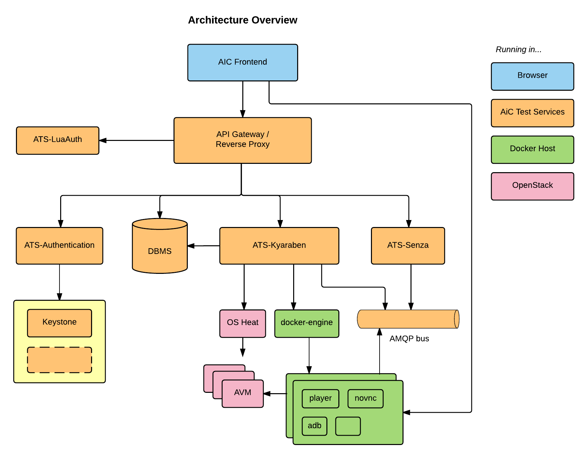

# [AiC Project](https://aic-project.github.io)

<!---
Android is an Open Source operating system developed by Google. It
was at first targeted to mobile devices but Today it is present, as
well, on televisions and watches. Leader on the mobile market, Android
is present in
[in more than 14 billion devices [Callaham, John. September 29, 2015.]](http://www.androidcentral.com/google-says-there-are-now-14-billion-active-android-devices-worldwide)
and it has more than
[2 million applications [AppBrain. January 16, 2017.]](http://www.appbrain.com/stats/number-of-android-apps).
-->

AiC is an Open Source project that facilitates Android application
testing. It offers many components to achieve Android virtualization
that can run applications and tests, allowing a fast feedback for the
application developer.

Two different AiC deployments are proposed:

* **Cloud version**: Android virtualized machines are deployed
within a cloud platform (Open Stack). The user can interact
with the Android machine through a web application (also deployed
within the cloud platform).
* **Local version**: Android virtualized machines are deployed locally
(in the user machine) through qemu-kvm/libvirt. The user can interact
with the Android machine through NoVNC and AiC CLI.

## Cloud Version Architecture

The AiC architecture is divided into four big groups:

* **Browser**: In the browser section we have one component, the **frontend** web application.
* **AiC Test Services (ATS)**: AiC Services are made of many components.
	* **ATS-LuaAuth**: Component responsible for the user authorization.
	* **ATS-Authentication**: Component responsible for the user authentication.
	* **ATS-Kyaraben**: Component responsible for virtual machine orchestration on the cloud platform (Android machine creation and removal). It also handles the database and data docker containers (project information, APKs, test files, etc).
	* **ATS-Senza**: Component that will interact with Android machine emulated sensors and services (GPS, battery, rotation, GSM, etc).
* **Docker host**: There are many services associated to each virtual Android machine created.
  The docker host will provide containers with these services, needed by the Android machine to work.
  One of these containers is **player**, the interface between Android machine and sensors emitters.
	Another of these containers is **player.camera**, a component that handles the Android machine camera input.
	There is also an extra ATS service that runs on the docker host, which is the **ATS-DSLcc**, a component that parsers the AiC Testing DSL to Java files.
* **OpenStack**: Cloud service where virtual Android machines are
deployed and all services are hosted. The Android machines images are
built with **ATS-RomBuild**.

All these components can be deployed using **AiC ATS build & deployment tools**.

Details about each component can be found on its own documentation and
project repository.

Component | Documentation | Github
---------- | --------------- | ----------------
ATS-LuaAuth | (NA) | [github](https://github.com/AiC-Project/ats.authorization)
ATS-Authentication | [documentation](sub/ats.authentication/) | [github](https://github.com/AiC-Project/ats.authentication)
ATS-Kyaraben | [documentation](sub/ats.kyaraben/) | [github](https://github.com/AiC-Project/ats.authorization)
ATS-Senza |  [documentation](sub/ats.senza/) | [github](https://github.com/AiC-Project/ats.senza)
player | [documentation](sub/player/) | [github](https://github.com/AiC-Project/player)
player.camera | [documentation](sub/player.camera/) | [github](https://github.com/AiC-Project/player.camera)
ATS-DSLcc | [documentation](sub/ats.dslcc/) | [github](https://github.com/AiC-Project/ats.dslcc)
ATS-RomBuild | [documentation](sub/ats.rombuild/) | [github](https://github.com/AiC-Project/ats.rombuild)
ATS build & deployment tools | [documentation](sub/ats.aic/) | [github](https://github.com/AiC-Project/ats.aic)

## Local Version Architecture

AiC Local can be imagined as a simplified version of the Cloud
service. It uses the same Android images as in the cloud version but
all services will run in the user machine.

We recommend the installation in a modern Linux distribution and it
should be able to run Docker 1.10+, and qemu-kvm through libvirt. The
installation details are available at
[documentation](sub/local-aic/)
and
[github repository](https://github.com/AiC-Project/local-aic).

## OpenGapps

Some Android applications depend on Google Apps (GApps).
Instructions on how to install GApps in the AiC Android roms are available in the 
[documentation](sub/ats.gapps/) 
and 
[github repository](https://github.com/AiC-Project/ats.gapps).

<!---
## License & Copyright

TODO
-->

